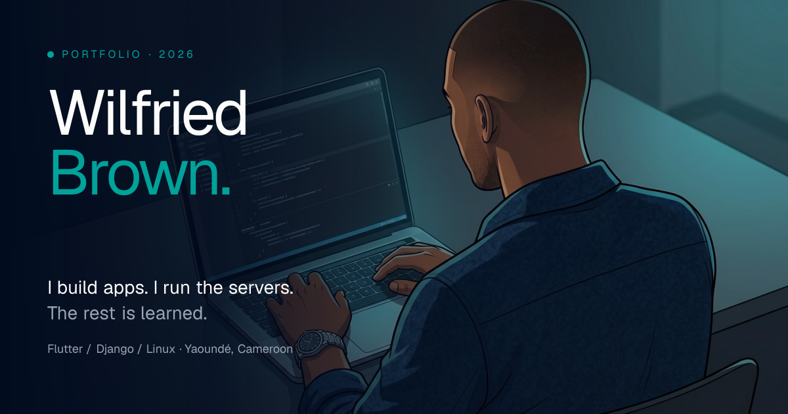

# wilbrown-portfolio

Personal portfolio of **Wilfried Brown DJOUTSOP TAKOU** — full-stack developer based in Yaoundé, Cameroon.

> *I build apps. I run the servers. The rest is learned.*

**Live:** [wilbrown-innova.com](https://wilbrown-innova.com)



---

## Stack

| Layer | Tech |
|---|---|
| Framework | Next.js 16 (App Router, Turbopack) · React 19 · TypeScript strict |
| Styling | Tailwind CSS v4 (brand tokens via `@theme inline`) |
| i18n | next-intl v4 (FR + EN, `localePrefix: "as-needed"`) |
| Content | MDX (bilingual case studies) + SQLite for admin-managed content |
| 3D | React Three Fiber + drei + postprocessing |
| Animations | GSAP + ScrollTrigger + SplitText (honor `prefers-reduced-motion`) |
| Admin auth | bcryptjs + jose (HS256 JWT cookie) |
| Database | better-sqlite3 (WAL mode) |
| Image processing | sharp (resize + EXIF auto-rotate on upload) |
| Email | Resend (contact form) |
| Icons | Lucide + Devicon + Simple Icons + custom inline SVG |

## Features

### Public site

- **Network Constellation 3D hero** — R3F scene with curl-noise flowfield, cursor attractor, post-processing fog
- **Bilingual** (FR/EN) with locale-aware routing, hreflang alternates, dynamic OG image per locale
- **4 long-form MDX case studies** (lumidata, snmp, quickshift, n8n) with sticky scroll-spy TOC and rehype-slug heading anchors
- **Dynamic Work index** — case studies sourced from MDX frontmatter, top 4 on the home + dedicated `/work` page
- **Showcase + Events sections** driven by SQLite, edited through the admin backoffice
- **Sitemap + robots.txt + per-locale OG image** auto-generated
- **A11y baseline** — skip-to-content link, focus-visible rings, semantic headings, alt text, `prefers-reduced-motion` respected throughout

### Admin backoffice (`/admin`)

- **Auth** — bcrypt password + HS256 JWT session cookie. Hash stored at `.auth/password.hash` (gitignored) with env-var fallback
- **Showcase CRUD** — projects with image upload (sharp → WebP), public grid has filter pills + lightbox modal
- **Events CRUD** — multi-photo galleries with cover picker, month picker (`YYYY-MM` stored, formatted per locale via `Intl.DateTimeFormat`), full-screen gallery lightbox with keyboard nav
- **Sub-nav** to switch between Showcase and Events tabs

### Footer signature

Live operator status: uptime dot (pulsing cyan), last deploy date, build hash (`git rev-parse --short HEAD`) — baked at build time, env-var override available for tarball deploys.

## Run locally

```bash
npm install
cp .env.example .env.local   # fill in RESEND_API_KEY, AUTH_SECRET, ADMIN_PASSWORD_HASH
npm run dev                  # http://localhost:3000
```

## Admin setup

```bash
# 1. Generate the JWT signing secret
npm run secret

# 2. Generate the bcrypt hash of your admin password (interactive)
npm run hash
# → writes to .auth/password.hash (preferred), or paste into .env.local
```

Then visit `http://localhost:3000/admin/login`.

## Scripts

| Command | What it does |
|---|---|
| `npm run dev` | Local development (Turbopack) |
| `npm run build` | Production build |
| `npm run start` | Serve production build |
| `npm run lint` | ESLint |
| `npm run hash` | Generate bcrypt hash for the admin password |
| `npm run secret` | Generate 64-char hex `AUTH_SECRET` |

## Project layout

```
src/
  app/[locale]/        # locale-aware public routes (FR + EN)
  app/admin/           # admin backoffice (always FR)
  app/actions/         # server actions (showcase, event, contact, auth)
  components/sections/ # Hero, About, Experience, Work, Showcase, Events, Stack, Contact
  components/three/    # R3F Network Constellation scene + camera rig
  components/admin/    # admin forms + tab nav
  content/projects/    # MDX case studies: {slug}.fr.mdx + {slug}.en.mdx
  lib/                 # db, auth, showcase, event, projects, build-info
  i18n/                # next-intl routing + navigation wrappers (locale-aware Link)
messages/              # fr.json + en.json (all UI copy)
public/                # static assets (avatars, logos, custom icons)
data/                  # SQLite DB (gitignored, auto-created on first run)
```

> See `AGENTS.md` and `CLAUDE.md` for AI agent instructions — they describe the codebase to LLM coding assistants. Not required reading for human contributors.

## Deployment

Self-hosted on a personal VPS with nginx reverse proxy + PM2 + Let's Encrypt + cron backup of `data/portfolio.db`. Deployment guide coming in Phase 6.

## License

All rights reserved. Code is personal and not licensed for reuse without permission. Content (writing, images, brand assets) © 2026 Wilfried Brown DJOUTSOP TAKOU.
